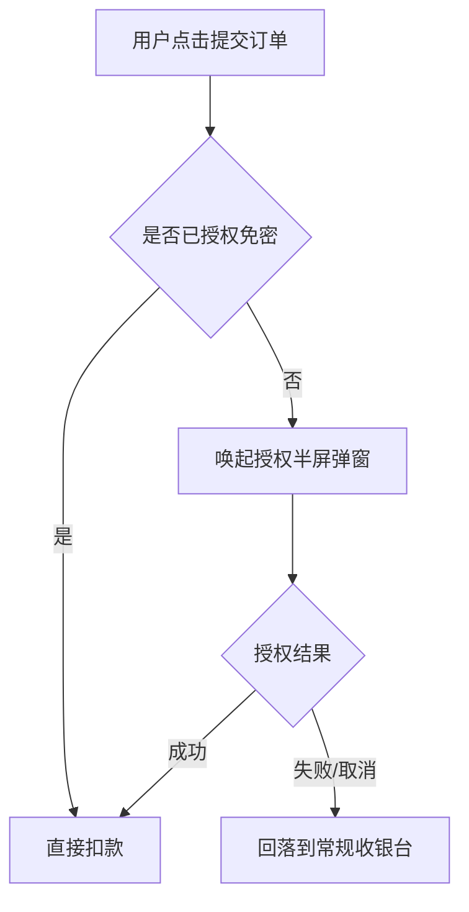

# PRD 模板（产品需求文档）

> 使用说明：复制本文件后重命名为「PRD-需求名称-vX.X.md」。所有 `<!-- -->` 注释为填写指引，写完后删除；斜体文字为示例占位，替换为实际内容。评审通过前版本号用 0.x，评审通过后转为 1.0。

---

## 1. 文档信息

| 项目 | 内容 |
|---|---|
| 文档版本 | *v0.3* <!-- 每次修改递增，重大改动进位 --> |
| 作者 | *张三（产品）* |
| 需求编号 | *REQ-2026-0712* <!-- 与需求池 ID 对齐，便于追溯 --> |
| 关联项目/迭代 | *App 6.8 迭代* |
| 目标上线时间 | *2026-08-15* |

**修订记录**

| 版本 | 日期 | 修改人 | 修改内容 |
|---|---|---|---|
| v0.1 | *2026-07-01* | *张三* | *初稿* |
| v0.2 | *2026-07-05* | *张三* | *根据技术预审调整第 5.2 节异常分支* |

**评审记录**

| 评审轮次 | 日期 | 参与人 | 结论 | 遗留问题 |
|---|---|---|---|---|
| 需求评审一审 | *2026-07-08* | *产品/研发/测试/设计* | *有条件通过* | *风控规则待安全团队确认* |

## 2. 背景与目标

### 2.1 背景

<!-- 回答三个问题：现状是什么？问题/机会是什么？为什么是现在做？用数据支撑，不要写"用户反馈强烈"这类无法验证的话 -->

*示例：当前订单支付成功率为 82%，低于行业基准 90%。漏斗分析显示 60% 的流失发生在「选择支付方式」页，其中 xx% 的用户因未绑卡退出。*

### 2.2 目标与衡量指标

<!-- 目标必须可量化、有时限、有基线。区分核心指标（判断成败）与护栏指标（不能恶化） -->

| 指标类型 | 指标 | 基线值 | 目标值 | 达成时限 |
|---|---|---|---|---|
| 核心指标 | *支付成功率* | *82%* | *≥88%* | *上线后 30 天* |
| 护栏指标 | *客诉率* | *0.3%* | *不高于 0.35%* | *持续监控* |

### 2.3 非目标

<!-- 明确声明本需求"不解决什么问题"，防止评审时范围蔓延 -->

*示例：本期不解决海外支付渠道问题，不涉及退款流程改造。*

## 3. 用户故事

<!-- 格式：作为【角色】，我想要【行为】，以便【价值】。每条故事对应至少一条验收标准（第 8 节） -->

| 编号 | 用户故事 | 优先级 |
|---|---|---|
| US-1 | *作为未绑卡的新用户，我想要在支付页一键唤起免密支付授权，以便不中断下单流程* | P0 |
| US-2 | *作为老用户，我想要系统记住我上次的支付方式，以便减少选择步骤* | P1 |

## 4. 需求范围

### 4.1 本期做

<!-- 列出功能点清单并标注优先级：P0 = 不做无法上线；P1 = 重要但可降级；P2 = 可延期 -->

| 功能点 | 优先级 | 说明 |
|---|---|---|
| *免密支付授权流程* | P0 | *详见 5.1* |
| *支付方式记忆* | P1 | *详见 5.2* |

### 4.2 本期不做

<!-- 写明"不做"及原因（技术依赖/优先级/合规待定），避免反复讨论 -->

- *支付方式排序个性化——数据量不足，待本期上线后积累数据*

## 5. 功能逻辑详述

<!-- 每个功能点一个小节：主流程 + 状态定义 + 异常分支。流程图可用 mermaid 或贴图 -->

### 5.1 功能点一：*免密支付授权*

**主流程图**

**状态定义**

| 状态 | 触发条件 | 页面表现 |
|---|---|---|
| *未授权* | *用户从未开通* | *展示授权引导入口* |
| *已授权* | *授权成功回调* | *默认免密支付* |
| *已解约* | *用户主动关闭* | *等同未授权，7 天内不再弹引导* |

**异常分支**

<!-- 逐条列出：网络超时、接口报错、并发冲突、边界值、用户中途退出等场景的处理方式 -->

| 异常场景 | 处理方式 | 用户提示文案 |
|---|---|---|
| *授权接口超时（>5s）* | *回落常规收银台，上报监控* | *"网络开小差了，请选择支付方式"* |
| *扣款失败（余额不足）* | *保留订单 15 分钟，引导换卡* | *"支付未完成，试试其他方式"* |

### 5.2 功能点二：*支付方式记忆*

<!-- 结构同 5.1，此处省略 -->

## 6. 数据与埋点需求

<!-- 事件命名遵循团队规范（如 模块_对象_动作）。每个事件写清触发时机，避免前后端理解不一致 -->

| 事件名 | 触发时机 | 事件属性 | 用途 |
|---|---|---|---|
| *pay_auth_popup_show* | *授权弹窗渲染完成时（非请求发出时）* | *user_type, order_amount* | *计算弹窗曝光量* |
| *pay_auth_result* | *收到授权回调时* | *result(成功/失败/取消), fail_reason* | *计算授权成功率* |

**报表需求**：*上线后需在 BI 看板新增「免密支付漏斗」，维度：渠道、用户分层。*

## 7. 非功能需求

| 类别 | 要求 |
|---|---|
| 性能 | *授权弹窗唤起耗时 P95 < 800ms* |
| 兼容性 | *iOS 14+ / Android 8+ / 主流机型 Top 30* |
| 安全合规 | *免密协议需展示并留存用户同意记录；符合支付业务监管要求* |
| 可用性 | *支付链路可用性 ≥ 99.95%，依赖方降级方案见 5.1 异常分支* |

## 8. 验收标准

<!-- 用 Given-When-Then 格式，测试可直接转为用例。逐条对应第 3 节用户故事 -->

- [ ] *AC-1（对应 US-1）：Given 用户未授权免密，When 点击提交订单，Then 800ms 内唤起授权弹窗且埋点 pay_auth_popup_show 正确上报*
- [ ] *AC-2（对应 US-1）：Given 授权接口超时，When 超过 5s 无响应，Then 自动回落常规收银台且订单状态不丢失*
- [ ] *AC-3（对应 US-2）：Given 用户上次使用微信支付，When 再次进入收银台，Then 微信支付默认选中*

## 9. 上线计划与灰度方案

### 9.1 里程碑

| 节点 | 时间 | 负责人 |
|---|---|---|
| 需求评审通过 | *07-10* | *产品* |
| 提测 | *07-28* | *研发* |
| 灰度开始 | *08-08* | *产品+研发* |
| 全量 | *08-15* | *产品* |

### 9.2 灰度方案

<!-- 写明：灰度维度（白名单/百分比/城市/渠道）、每阶段放量比例、观察指标与放量标准、回滚条件 -->

| 阶段 | 流量比例 | 观察时长 | 放量标准 | 回滚条件 |
|---|---|---|---|---|
| 阶段一 | *1%（内部白名单）* | *2 天* | *无 P0 级 bug* | *支付成功率下跌 >2pp 或出现资损* |
| 阶段二 | *10%* | *3 天* | *核心指标不劣于对照组* | *同上* |
| 全量 | *100%* | *持续监控 30 天* | — | *保留功能开关，可 5 分钟内关闭* |

**回滚预案**：*通过配置中心开关 pay_auth_enable 一键关闭，关闭后所有用户走原收银台逻辑；已授权用户的协议不受影响。*
